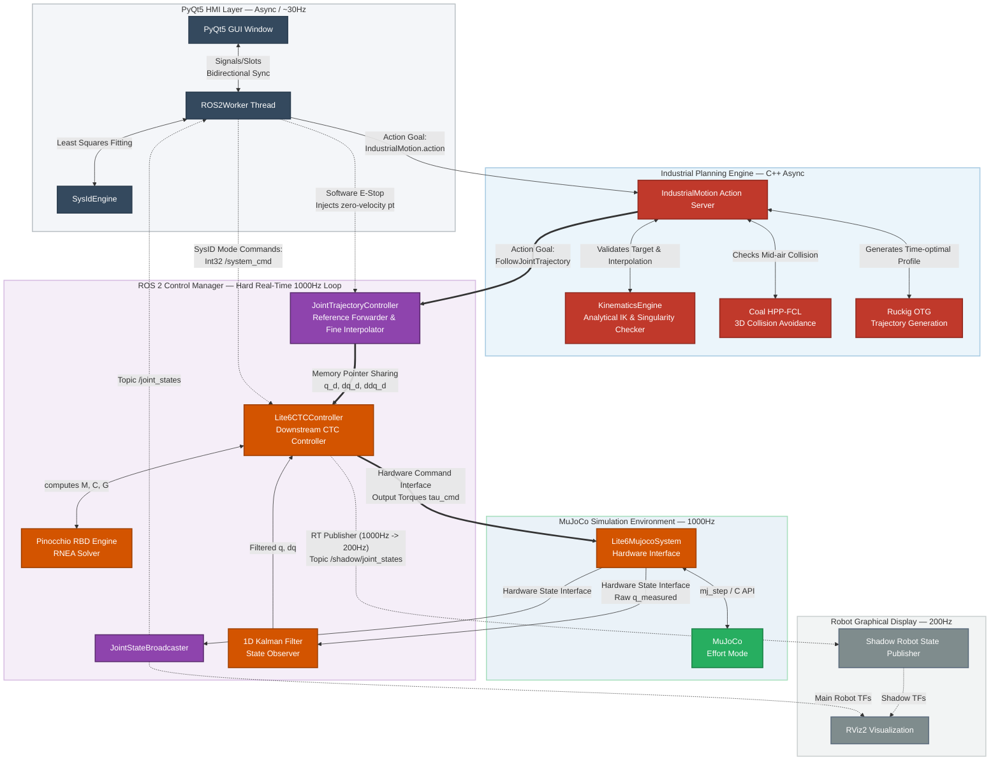
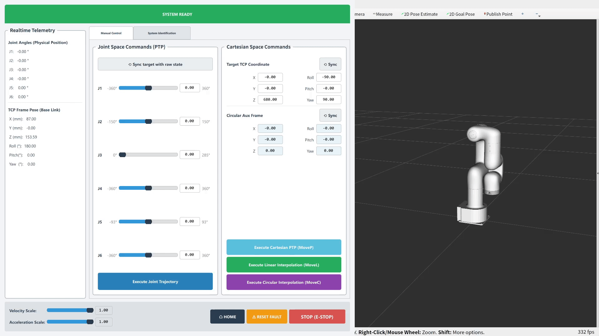
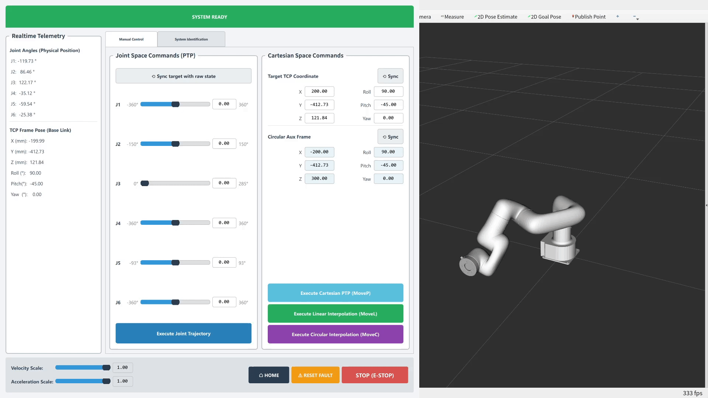
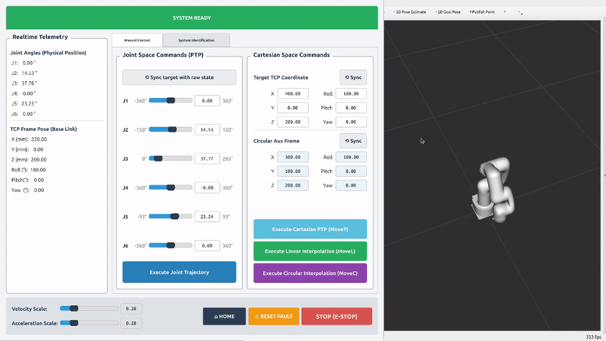

# Deterministic Motion Planning and Dynamics Control Framework for Lightweight 6-Axis Robotic Arms


This repository presents a high-fidelity, mathematically rigorous 6-axis robotic arm simulation and control framework. Initiated by an asynchronous and detailed GUI (based on PyQt5), the system orchestrates high-level motion using a **custom-built, deterministic C++ planning engine**, bypassing standard frameworks like MoveIt2. This planner leverages a **closed-form Analytical Inverse Kinematics** solver (derived via Maple symbolic computation), combined with **Coal (formerly HPP-FCL)** for 3D collision avoidance and symbolic Jacobian determinant analysis for singularity detection. Trajectory generation is handled by **Ruckig**, providing time-optimal profiles for Joint Space (**MoveJ**), Cartesian Space (**MoveP**), Linear (**MoveL**), and Circular (**MoveC**) Cartesian motions.

At the core, **Controller Chaining** (based on **ros2_control**) interpolates these trajectories into a tight 1000Hz reference for a custom **Computed Torque Control (CTC)** downstream controller. To ensure physical realism, the CTC bypasses **MuJoCo**’s default PID joints to run the physics engine in pure **effort mode**. The CTC processes the feedback states via a **1D Kalman Filter** state observation model to reconstruct noise-free joint velocities, and executes **Pinocchio** dynamics calculations to compute rigid-body inertia, gravity, and Coriolis matrices. Combined with **friction/armature compensation** (smoothly neutralizing viscous damping, Coulomb stiction, and motor rotor inertia), this architecture achieves a tracking precision of $<0.01\text{ mm}$.

To bridge the gap between nominal simulation parameters and real-world physical discrepancies, an automated **system identification** (SysID) framework is integrated to extract joint-level viscous/Coulomb friction and motor armature coefficients, which are difficult to measure directly during manufacturing. Utilizing a bounded **Fourier excitation trajectory** coupled with an offline **Least-Squares solver**, the identified parameters align closely with the ground-truth physical properties defined in the URDF and MuJoCo XML files. Furthermore, the architecture incorporates a robust software emergency stop (E-Stop) and active recovery state machine. Upon triggering, it overrides high-level commands to execute precise, kinematic-limit-aware deceleration trajectories that safely halt the manipulator, while providing a seamless recovery sequence back to the active closed-loop tracking state.

To facilitate real-time diagnostics and visual verification of tracking performance, the framework incorporates a synchronized **"shadow robot"** virtual twin. This visualization layer is driven directly by the real-time C++ CTC controller via a lock-free `RealtimePublisher`. It renders the exact internal target commands (`q_target_`) at 1000Hz (downsampled to 200Hz for RViz), representing the manipulator's theoretical kinematic state under zero-disturbance conditions. The shadow robot depicts pure kinematic targets, while the closed-loop CTC controller forces the physical manipulator to overcome physical disturbances (gravity, Coriolis, joint friction, etc.) to track this reference.

For detailed mathematical derivations of the analytical IK and Jacobian matrices, please refer to [Kinematics.pdf](Kinematics.pdf).

For detailed mathematical derivations of the CTC controller and the SysID process, please refer to [Theory.pdf](Theory.pdf).

> ⚠️ **Notice:** The robot model used in this simulation is the **UFactory Lite6**, sourced from the official [MuJoCo Menagerie](https://github.com/google-deepmind/mujoco_menagerie). This repository is an independent open-source project designed for research and educational purposes.

<p align="center">
  
</p>


## 📑 Table of Contents
1. [System Architecture](#-system-architecture)
2. [Core Features & Demonstrations](#-core-features--demonstrations)
3. [Quick Start & Reproduction Guide](#-quick-start--reproduction-guide)
4. [Future Work](#-future-work)
5. [Acknowledgements](#-acknowledgements)
6. [Disclaimer](#-disclaimer)
7. [Contact](#-contact)


## 🧠 System Architecture
The system's architecture is illustrated in the diagram below:



## 🎥 Core Features & Demonstrations

### 1. Industrial Motion Planning (PTP, MoveL, MoveC)

*   **PTP (Point-to-Point):** Joint space planning (MoveJ) or Cartesian target planning (MoveP) utilizing the optimal inverse kinematic configuration.
<p align="center">
  
</p>

<p align="center">
  
</p>

*   **MoveL:** Deterministic linear Cartesian interpolation using SLERP for quaternion orientation and Jacobian pseudoinverse mapping.

<p align="center">
  
</p>

*   **MoveC:** Circular Cartesian interpolation using an auxiliary midpoint frame.

<p align="center">
  
</p>

### 2. Automated System Identification
*   The automated system identification executes bounded Fourier excitation trajectories, records $q, \dot{q}, \tau$, and utilizes **Least Squares Optimization** to extract exact **Armature, Viscous Friction, and Coulomb Friction** matrices.

<p align="center">
  
</p>

### 3. The "Shadow Robot" Debugging Twin
*   This is a collision-free, cyan-colored digital twin that runs alongside the main robot. It reflects the controller's target commands, allowing instant visual verification of tracking error and dynamic deviations.

<p align="center">
  
</p>

### 4. Software E-Stop and Recovery
*   The emergency stop overrides the current trajectory and generates a safe deceleration trajectory based on physical kinematic limits.

<p align="center">
  
</p>

## 🚀 Quick Start & Reproduction Guide

You can run this project using either a containerized Docker environment (recommended for avoiding dependency conflicts) or natively on Ubuntu 24.04.

### 📋 Prerequisites

Download the repository and organize your workspace as follows:
```text
~/lite6_ws/
├── mujoco-3.9.0/          # MuJoCo binaries (provided in this repository)
├── src/                   # Source code (lite6_bringup, lite6_planner, etc.)
├── Dockerfile             # Docker configuration
├── run_docker.sh          # Container boot script
└── README.md
```
### 🐳 Option A: Docker Deployment
This method isolates the environment and requires no local ROS 2 installation. Ensure you have a Linux host (Ubuntu 22.04 or higher), [Docker](https://docs.docker.com/engine/install/) and the [NVIDIA Container Toolkit](https://docs.nvidia.com/datacenter/cloud-native/container-toolkit/latest/install-guide.html) (recommended for GUI rendering and GPU acceleration).

**1. Start the Docker Environment:**
```bash
cd ~/lite6_ws
chmod +x ./run_docker.sh
./run_docker.sh
```
*(Note: The script automatically detects your GPU and chooses suitable drivers if you are using an Intel/AMD GPU or no GPU. It also automatically mounts the `src` folder, so you do not need to rebuild the image when modifying code).*

**2. Build and Launch (Inside Docker):**
```bash
colcon build --symlink-install
source install/setup.bash
ros2 launch lite6_bringup system_bringup.launch.py
```
### 💻 Option B: Native Deployment (Ubuntu 24.04)
If you prefer running natively, ensure you have **ROS2 Jazzy** installed on your host machine.

**1. Setup MuJoCo Binaries:**
Move the provided MuJoCo binaries to your home directory and link them to your `.bashrc`.
```bash
mkdir -p ~/.mujoco
cp -r ~/lite6_ws/mujoco-3.9.0 ~/.mujoco/

# Add MuJoCo paths to your bash profile
echo 'export MUJOCO_DIR=~/.mujoco/mujoco-3.9.0' >> ~/.bashrc
echo 'export LD_LIBRARY_PATH=$LD_LIBRARY_PATH:$MUJOCO_DIR/lib' >> ~/.bashrc
source ~/.bashrc
```

**2. Install ROS 2 Dependencies (`rosdep`):**
Use `rosdep` to automatically install all required packages (Pinocchio, Coal, Ruckig, etc.).
```bash
cd ~/lite6_ws
rosdep update
rosdep install --from-paths src --ignore-src -r -y
```

**3. Compile and Launch:**
```bash
colcon build --symlink-install
source install/setup.bash
ros2 launch lite6_bringup system_bringup.launch.py
```

## 🔮 Future Work
This framework is actively evolving. Upcoming features include:
- **End-Effector Integration:** Adding URDF and controller support for parallel jaw grippers to facilitate pick-and-place tasks.
- **Friction Modeling Improvement:** Replacing the current model with the LuGre friction model.
- **Advanced Control Algorithms:** Impedance control, admittance control, etc.

## 🙏 Acknowledgements

I would like to sincerely thank the creators and maintainers of the following open-source projects and organizations:

*   **[MuJoCo](https://mujoco.org/)**
*   **[MuJoCo Menagerie](https://github.com/google-deepmind/mujoco_menagerie)**
*   **[ros2_control](https://control.ros.org/)**
*   **[Pinocchio](https://stack-of-tasks.github.io/pinocchio/)**
*   **[Coal / HPP-FCL](https://github.com/coal-library/coal)**
*   **[Ruckig](https://ruckig.com/)**

## 📌 Disclaimer

This is a personal, open-source project. I am not affiliated with, sponsored by, or endorsed by any commercial entities mentioned in this repository. All trademarks and registered trademarks are the property of their respective owners. The software is provided "as is", without warranty of any kind.

## 📬 Contact

If you have any questions about this repository, you can raise an issue or contact [](mailto:wtianyi947@gmail.com) directly.
